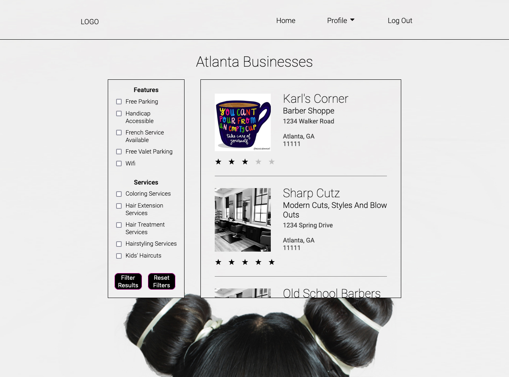

<!-- Repo Shields. See https://shields.io for others or to customize this set of shields.   -->

<!--  -->

<!-- https://github.com/Brridge-Group/Lions-Gate-Hairr/stargazers -->
<!-- https://github.com/Brridge-Group/Lions-Gate-Hairr f32dc8-->

<!-- Starts Here -->

# <h1 align="center">HairrKeepers</h1>

#### <h3 align="center">https://hairr-app.herokuapp.com</h3>

 <!-- <h5 align="center">TEAM</h5>       -->

 

 

 

## 📝 Description

---

Hairr || HairrKeepers helps its customers find the right hair experts in any city within the United States and Canada, fueled with the informative reviews of previous customers to ensure they are in expert hands. A TypeScript and React front-end applications using modern React best practices, including React Hooks, while utilizing Express, Node.js, and MongoDB for database management. An open-source project built by a fully distributed engineering team building. Together the team employs technologies like GitHub, Slack, and Jira to work for effective team communication.

## 🖼️ Screenshots

---

 
 📊 ERD

 <!-- TODO: [ ] - Requesting Section Completion By Sergio -->

| Description                 | Screenshot                                                                |
| --------------------------- | ------------------------------------------------------------------------- |
| <h3 align="center">ERD</h3> |  |

 
 🎨 Wireframes

  <!-- TODO: [ ] - Requesting Section Completion By Cynthia -->

| Description                          | Screenshot                                                             |
| ------------------------------------ | ---------------------------------------------------------------------- |
| Desktop Layout | Device Size Ranges: 540 - 990 Max                                      |
| <h3 align="center">Home Page</h3>    |  |
| <h3 align="center">Profile Page</h3> |   |
| Mobile Layout                        | Device Size Ranges: 340 - 540 Max                                      |
| <h3 align="center">Home Page</h3>    |  |
| <h3 align="center">Profile Page</h3> |   |

<!-- 
 -->

 
 ⚙️ Functionality

 
 | Description | Screenshot |
 |------------ | ------------|
 | <h3 align="center">Business List Page</h3>  <h6 align="center" style={"font-type"}>Filter Businesses by Features & Services</h6> | 
 | <h3 align="center">Business Details Page</h3> | 
 | <h3 align="center">Business Customer Review Page</h3> <h6 align="center" style={}>Leave Customer Feedback</h6>  | 
 | <h3 align="center">User Profile Page</h3>  <h6 align="center" style={}>Edit User Profile Data & Add a Business</h6> | 
 | <h3 align="center">Owner Profile Page</h3>  <h6 align="center" style={}>Edit Business Profile Data </h6>| 

